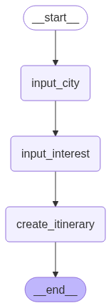
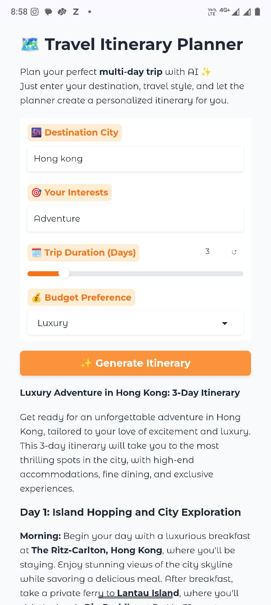
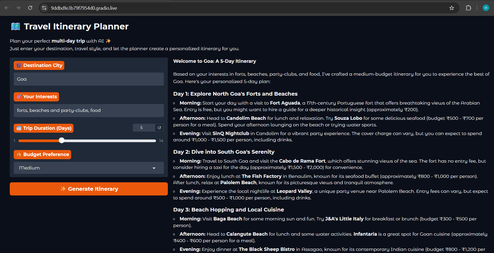

# Personal-Travel-Itinerary-Planner
An AI-powered web app that helps you plan multi-day travel itineraries based on your destination, interests, trip duration, and budget preference.
Just enter where you want to go, what you love, and how many days you’ll stay — the assistant will generate a personalized day-by-day itinerary with activities, food recommendations, and travel tips. ✨

🚀 Features

🌆 Destination-based planning – Generate itineraries for any city in the world.

🎯 Custom interests – Museums, food, shopping, adventure, history, nightlife, etc.

🗓️ Flexible trip duration – Choose from 1 to 14 days.

💰 Budget options – Low, Medium, or Luxury travel experiences.

📌 Day-wise schedule – Structured by morning, afternoon, and evening.

✨ Modern UI – Clean design with emojis, sliders, dropdowns, and Markdown output.

🛠️ Tech Stack

Python

Gradio
 – UI framework for interactive apps

LangChain
 – LLM orchestration

Groq LLM (Llama-3.3-70B)
 – AI model for generating itineraries

⚡ How It Works

User provides:

City/ State/ Country 🌆

Interests 🎯

Days 🗓️

Budget 💰

The app sends the query to the Groq-powered AI model.

The AI generates a personalized itinerary, formatted day by day.

# App Screenshots

The results are displayed in a modern UI with Markdown.
